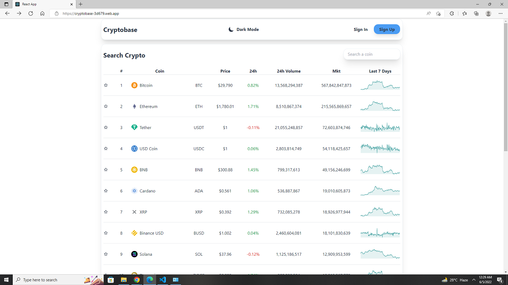

# Crypto Website with React JS - Tailwind CSS - FIREBASE   
    
  

### Live Link - https://cryptobase-3d679.web.app/

 

I used React, React Router, Context Api, Light/Dark Theme, Firebase, Firebase Authentication, Protected Route, Axios, Api, Tailwind Css, React Icons to build the project  .
 

### Api Link

TrendingCoin: https://api.coingecko.com/api/v3/coins/markets?vs_currency=usd

CoinDetails:  https://api.coingecko.com/api/v3/coins/${params.coinId}
 

### Env Variables 
REACT_APP_FIREBASE_API_KEY=
 
REACT_APP_FIREBASE_AUTH_DOMAIN= 
REACT_APP_FIREBASE_PROJECT_ID= 
REACT_APP_FIREBASE_STORAGE_BUCKET= 
REACT_APP_MESSAGING_SENDER= 
REACT_APP_APP_ID= 

### Author Links  

👋 Hello,I am Shadman and I am a Full Stack Web developer  

🚀 Follow me:  

  - [Github](https://github.com/sakibshadman19)
  - [LinkedIn](https://www.linkedin.com/in/shadmansakib1/)

  

<!-- all link is here -->

